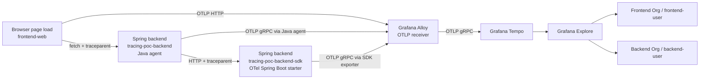

# Tracing PoC: browser -> Spring backend chain -> Tempo

This PoC follows the OpenTelemetry browser and Java agent getting-started flow closely, then adds a second Spring backend that is instrumented with OpenTelemetry dependencies in `pom.xml` instead of the Java agent. The demo request path is `browser -> backend -> backend-sdk`.

For the dependency-based backend, the setup now follows the Spring blog approach as closely as possible for a Spring Boot 3.5 application: since the Spring team's `spring-boot-starter-opentelemetry` is still a Spring Boot 4 era option, this PoC uses the OpenTelemetry Spring Boot starter as the closest supported dependency-based path on Boot 3.5. The `backend-sdk` module is pinned to Spring Boot `3.5.14`, and its Docker image is pinned to Temurin `25.0.2`.

Grafana is bootstrapped with two separate organizations and logins:

- `Frontend Org` / user `frontend-user`
- `Backend Org` / user `backend-user`

Both orgs query the same shared Tempo tenant (`shared-trace`) so the end-to-end trace stays connected.

## What is included

- `frontend/`: Vite + React app with OpenTelemetry Web SDK and fetch instrumentation.
- `backend/`: Spring Boot service started with the OpenTelemetry Java agent.
- `backend-sdk/`: Spring Boot service using the OpenTelemetry Spring Boot starter.
- `alloy/`: Grafana Alloy config.
- `tempo/`: Tempo config.
- `grafana/`: Grafana datasource provisioning and org bootstrap.
- `compose.yml`: one-command local stack.

## Architecture

1. The browser creates one parent span for the demo flow.
2. The browser calls the Java-agent backend with `traceparent`.
3. The Java-agent backend calls the SDK backend and propagates the trace context downstream.
4. Both backends continue the same trace.
5. Grafana Alloy forwards all spans to Tempo.



## Run the PoC

```bash
docker compose -f compose.yml up --build
```

Open these URLs after the containers are healthy:

- Frontend: http://localhost:5173
- Java-agent backend: http://localhost:8080/api/trace
- SDK backend: http://localhost:8082/api/trace
- SDK backend actuator: http://localhost:8081/actuator/health
- Alloy OTLP gRPC: `localhost:4317`
- Alloy OTLP HTTP: `http://localhost:4318/v1/traces`
- Grafana: http://localhost:3000

Grafana credentials:

- username: `admin`
- password: `admin`

Tenant-specific Grafana logins:

- Frontend view: `frontend-user` / `frontend-pass`
- Backend view: `backend-user` / `backend-pass`

## Verify trace propagation

1. Open the frontend at `http://localhost:5173`.
2. Wait for the page to automatically trigger the browser request to the Java-agent backend.
3. Copy the frontend trace ID shown in the UI.
4. In Grafana, open **Explore**, keep the default `Tempo Shared` datasource, and search for that trace ID.
5. Confirm that the trace contains connected spans from:
   - `frontend-web`
   - `tracing-poc-backend`
   - `tracing-poc-backend-sdk`
6. Compare the response payload:
    - `frontendSpan.traceId`, `agentBackend.traceId`, and `sdkBackend.traceId` should all match.
    - `agentBackend.incomingTraceparent` should show the browser-to-backend context.
    - `sdkBackend.incomingTraceparent` should show the backend-to-backend context.

You can also inspect the container logs to see the same request correlated by trace and span IDs:

```bash
docker compose -f compose.yml logs -f backend backend-sdk
```

## How `backend-sdk` is set up

`backend-sdk` exists to show the dependency-based approach, in contrast to `backend/` which uses `-javaagent`.

The setup is intentionally small:

1. `backend-sdk/pom.xml` keeps normal Spring Boot web dependencies and imports the OpenTelemetry instrumentation BOM.
2. The app adds `io.opentelemetry.instrumentation:opentelemetry-spring-boot-starter`.
3. No custom `OpenTelemetryConfig` bean is needed.
4. No custom servlet tracing filter is needed.
5. `backend-sdk/src/main/resources/application.yml` contains the OpenTelemetry settings directly in the codebase:
   - `otel.service.name=tracing-poc-backend-sdk`
   - `otel.exporter.otlp.endpoint=http://alloy:4317`
   - `otel.exporter.otlp.protocol=grpc`
   - `otel.traces.exporter=otlp`
   - `otel.metrics.exporter=none`
   - `otel.logs.exporter=none`
   - `otel.propagators=tracecontext,baggage`
6. Docker Compose only needs to run the container and expose the app port plus the actuator port; it no longer has to provide the OTel exporter settings for `backend-sdk`.

The actual config in `backend-sdk/src/main/resources/application.yml` looks like this:

```yaml
server:
  port: ${SERVER_PORT:8080}

management:
  server:
    port: ${MANAGEMENT_SERVER_PORT:8081}

otel:
  service:
    name: ${OTEL_SERVICE_NAME:${spring.application.name}}
  resource:
    attributes:
      service.namespace: ${OTEL_SERVICE_NAMESPACE:tracing-poc}
      deployment.environment.name: ${OTEL_DEPLOYMENT_ENVIRONMENT:local}
  traces:
    exporter: otlp
  metrics:
    exporter: none
  logs:
    exporter: none
  propagators: tracecontext,baggage
  exporter:
    otlp:
      protocol: grpc
      endpoint: http://alloy:4317
```

Because the Spring Boot starter wires OpenTelemetry automatically, the controller can stay simple and just read:

- `Span.current().getSpanContext()` to show the active trace/span IDs
- the incoming `traceparent` header to prove propagation reached the service

That is why the controller code only contains demo response logic, not tracing bootstrap code.

## Did this follow the Spring guide?

Yes, with one practical adjustment.

The Spring blog direction is to prefer Spring-managed, dependency-based OpenTelemetry setup instead of the Java agent when instrumentation should live in the application itself. This PoC follows that idea for `backend-sdk`.

However, it does **not** use the exact Spring Boot 4 starter from the blog, because this PoC is on Spring Boot `3.5.14`. For Boot 3.5, the closest supported equivalent is `io.opentelemetry.instrumentation:opentelemetry-spring-boot-starter`, so that dependency is used here.

In short:

- `backend/` = Java agent path
- `backend-sdk/` = Spring Boot dependency path
- same OTLP destination (`alloy:4317`)
- same propagation format (`traceparent`)
- both end up in the same Tempo trace

## Process used to add `backend-sdk`

1. Create a second Spring Boot app and expose its actuator endpoint separately.
2. Start with the existing Java-agent backend behavior as the functional target: accept an HTTP request and report trace details.
3. Replace the earlier manual SDK/filter experiment with the OpenTelemetry Spring Boot starter so the example stays closer to Spring guidance and remains smaller.
4. Configure export through standard `otel.*` properties in `backend-sdk/src/main/resources/application.yml`.
5. Keep the controller minimal and verify that `Span.current()` already contains the propagated context.
6. Update the frontend so one browser span wraps one fetch to `backend`, and let `backend` call `backend-sdk`.
7. Validate that both backend responses report the same `traceId` and a non-missing `incomingTraceparent`.
8. Confirm Tempo stores the spans under the shared tenant so Grafana can show one connected trace.

## Generic Java Spring Boot setup options

Based on the Spring guidance, there are two common ways to instrument a Spring Boot service.

### 1. Spring Boot dependency path

Add the required dependencies. `opentelemetry-spring-boot-starter` provides auto-configuration and automatic instrumentation, so the application does not need custom OpenTelemetry setup beans or servlet filters.

```xml
<dependency>
    <groupId>io.opentelemetry.instrumentation</groupId>
    <artifactId>opentelemetry-spring-boot-starter</artifactId>
</dependency>
<dependency>
    <groupId>io.opentelemetry</groupId>
    <artifactId>opentelemetry-api</artifactId>
</dependency>
```

Keep `opentelemetry-api` only if the application code directly uses OpenTelemetry classes such as `Span.current()`.

The runtime settings can be placed directly in `application.yml`:

```yaml
otel:
  service:
    name: ${OTEL_SERVICE_NAME:service-name}
  resource:
    attributes: service.namespace=service-name,deployment.environment=dev
  traces:
    exporter: otlp
  metrics:
    exporter: none
  logs:
    exporter: none
  propagators: tracecontext,baggage
  exporter:
    otlp:
      protocol: grpc
      endpoint: http://alloy.alloy.svc.cluster.local:4317
```

Alternatively, the same values can be provided through environment variables instead of `application.yml`.

### 2. Java agent path (Zero Code)

This approach does not require application code changes for instrumentation. The service runs with the OpenTelemetry Java agent, and configuration can be provided through JVM options, environment variables, or directly in the Dockerfile.

Example startup:

```bash
java -javaagent:/otel/opentelemetry-javaagent.jar -jar app.jar
```

Example environment variables:

```bash
OTEL_SERVICE_NAME=service-name
OTEL_RESOURCE_ATTRIBUTES=service.namespace=service-name,deployment.environment=dev
OTEL_TRACES_EXPORTER=otlp
OTEL_METRICS_EXPORTER=none
OTEL_LOGS_EXPORTER=none
OTEL_EXPORTER_OTLP_PROTOCOL=grpc
OTEL_EXPORTER_OTLP_ENDPOINT=http://alloy.alloy.svc.cluster.local:4317
OTEL_PROPAGATORS=tracecontext,baggage
```

Example Dockerfile:

```dockerfile
FROM eclipse-temurin:25-jre

WORKDIR /app

COPY app.jar /app/app.jar
COPY opentelemetry-javaagent.jar /otel/opentelemetry-javaagent.jar

ENV OTEL_SERVICE_NAME=service-name
ENV OTEL_RESOURCE_ATTRIBUTES=service.namespace=service-name,deployment.environment=dev
ENV OTEL_TRACES_EXPORTER=otlp
ENV OTEL_METRICS_EXPORTER=none
ENV OTEL_LOGS_EXPORTER=none
ENV OTEL_EXPORTER_OTLP_PROTOCOL=grpc
ENV OTEL_EXPORTER_OTLP_ENDPOINT=http://alloy.alloy.svc.cluster.local:4317
ENV OTEL_PROPAGATORS=tracecontext,baggage

ENTRYPOINT ["java","-javaagent:/otel/opentelemetry-javaagent.jar","-jar","/app/app.jar"]
```

In this PoC, the zero-code backend follows this Dockerfile-based pattern: the Java agent JAR is downloaded during image build, the `OTEL_*` settings are defined with `ENV`, and the container starts with `-javaagent` in the image `ENTRYPOINT`.

The `opentelemetry-javaagent.jar` file can be downloaded from the OpenTelemetry Java instrumentation releases:

- GitHub releases: `https://github.com/open-telemetry/opentelemetry-java-instrumentation/releases`
- direct artifact pattern: `https://github.com/open-telemetry/opentelemetry-java-instrumentation/releases/download/v<version>/opentelemetry-javaagent.jar`

Example build step:

```dockerfile
ADD https://github.com/open-telemetry/opentelemetry-java-instrumentation/releases/download/v2.29.0/opentelemetry-javaagent.jar /otel/opentelemetry-javaagent.jar
```

The same settings can also be passed from Docker Compose, Kubernetes manifests, or container platform environment configuration instead of baking them into the image.

For OTLP gRPC, the endpoint should look like `http://host:4317`. For OTLP HTTP/protobuf, the trace endpoint should look like `http://host:4318/v1/traces`.

## Generic Go setup options

For Go services, the common paths are standard SDK instrumentation and a newer zero-code eBPF-based path.

### 1. Go SDK path

Add the OpenTelemetry Go API, SDK, OTLP exporter, and HTTP instrumentation packages:

```bash
go get go.opentelemetry.io/otel \
       go.opentelemetry.io/otel/sdk \
       go.opentelemetry.io/otel/exporters/otlp/otlptrace/otlptracegrpc \
       go.opentelemetry.io/contrib/instrumentation/net/http/otelhttp
```

Example setup:

```go
package main

import (
	"context"
	"net/http"

	"go.opentelemetry.io/contrib/instrumentation/net/http/otelhttp"
	"go.opentelemetry.io/otel"
	"go.opentelemetry.io/otel/exporters/otlp/otlptrace/otlptracegrpc"
	"go.opentelemetry.io/otel/propagation"
	"go.opentelemetry.io/otel/sdk/resource"
	sdktrace "go.opentelemetry.io/otel/sdk/trace"
	semconv "go.opentelemetry.io/otel/semconv/v1.26.0"
)

func setupOTel(ctx context.Context) (func(context.Context) error, error) {
	exporter, err := otlptracegrpc.New(
		ctx,
		otlptracegrpc.WithEndpoint("alloy.alloy.svc.cluster.local:4317"),
		otlptracegrpc.WithInsecure(),
	)
	if err != nil {
		return nil, err
	}

	tp := sdktrace.NewTracerProvider(
		sdktrace.WithBatcher(exporter),
		sdktrace.WithResource(resource.NewWithAttributes(
			semconv.SchemaURL,
			semconv.ServiceName("service-name"),
		)),
	)

	otel.SetTracerProvider(tp)
	otel.SetTextMapPropagator(
		propagation.NewCompositeTextMapPropagator(
			propagation.TraceContext{},
			propagation.Baggage{},
		),
	)

	return tp.Shutdown, nil
}

func main() {
	handler := http.HandlerFunc(func(w http.ResponseWriter, r *http.Request) {
		_, _ = w.Write([]byte("ok"))
	})

	http.ListenAndServe(":8080", otelhttp.NewHandler(handler, "http.server"))
}
```

Common environment-variable equivalents:

```bash
OTEL_SERVICE_NAME=service-name
OTEL_RESOURCE_ATTRIBUTES=service.namespace=service-name,deployment.environment=dev
OTEL_TRACES_EXPORTER=otlp
OTEL_METRICS_EXPORTER=none
OTEL_LOGS_EXPORTER=none
OTEL_EXPORTER_OTLP_PROTOCOL=grpc
OTEL_EXPORTER_OTLP_ENDPOINT=http://alloy.alloy.svc.cluster.local:4317
OTEL_PROPAGATORS=tracecontext,baggage
```

In this path, telemetry is configured in the service, and tracing libraries are linked into the application.

### 2. Go zero-code path

Go zero-code instrumentation exists, and the current OpenTelemetry zero-code path for Go is based on eBPF instrumentation.

The OpenTelemetry zero-code Go documentation describes this as work in progress. It is typically used through eBPF-based tooling, and the Auto SDK can connect manual spans to the same trace when the service is already being auto-instrumented.

Key points:

- no application code changes are required for the automatically instrumented libraries
- coverage is currently limited compared with the Java agent approach
- the Auto SDK is meant to unify manual spans with eBPF-generated spans
- there is no equivalent Dockerfile pattern like `COPY opentelemetry-javaagent.jar` and `-javaagent`

Example manual span that can join zero-code eBPF spans through the Auto SDK:

```go
package main

import (
	"net/http"

	"go.opentelemetry.io/otel"
)

func main() {
	http.HandleFunc("/", func(w http.ResponseWriter, r *http.Request) {
		tracer := otel.Tracer("service-name")
		_, span := tracer.Start(r.Context(), "manual-span")
		defer span.End()

		w.WriteHeader(http.StatusOK)
	})

	http.ListenAndServe(":8080", nil)
}
```

In that model, the automatic spans come from the Go zero-code eBPF instrumentation layer, while the manual span uses the OpenTelemetry API and joins the same trace through the Auto SDK.

## Useful notes

- The browser exports traces with OTLP HTTP to Grafana Alloy at `http://localhost:4318/v1/traces`.
- The Java-agent backend exports traces with OTLP gRPC to Grafana Alloy at `alloy:4317`.
- The SDK backend exports traces with OTLP gRPC to Grafana Alloy at `alloy:4317` through the OpenTelemetry Spring Boot starter, using properties stored in `backend-sdk/src/main/resources/application.yml`.
- Grafana Alloy forwards traces to Tempo at `tempo:4317` with tenant header `X-Scope-OrgID: shared-trace`.
- Tempo multi-tenancy is enabled, but both Grafana orgs intentionally read the same Tempo tenant so one trace can still contain both backend spans.
- `backend-sdk` keeps its runtime OTel settings in the codebase because Spring reads `application.yml` before the starter config is applied.
- The Java-agent backend is different: its OTel settings are defined in `backend/Dockerfile`, because the Java agent starts before Spring reads `application.yml`.
